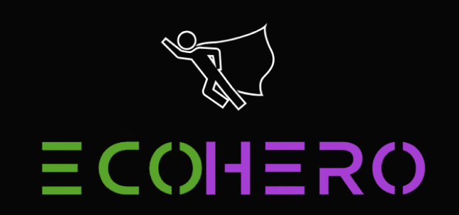

# fiap-ecohero

# ESG - EcoHero

## 

# EcoHero

Projeto criado para entrega de trabalho da FIAP, ano 2, semestre 2. 
EcoHero é uma plataforma destinada a promover práticas sustentáveis e responsabilidade social entre os colaboradores de uma empresa. 
A plataforma incentiva os colaboradores a adotarem hábitos mais saudáveis e sustentáveis tanto dentro quanto fora do ambiente de trabalho, por meio de desafios gamificados e recompensas.

## Funcionalidades

### Usuários

1. **Administradores:**
   - Podem cadastrar a empresa.
   - Determinar a duração do ciclo dos inputs dos colaboradores.
   - Definir quais serão as recompensas possíveis de resgate.

2. **Colaboradores:**
   - Devem estar vinculados a uma empresa cadastrada.
   - Criam um perfil com um personagem heróico.
   - Sobem de nível (EXP) a cada missão aceita e concluída (desafios).
   - Podem trocar EXP por produtos/brindes fornecidos pela empresa ao final de um ciclo.

### Desafios

Os colaboradores podem participar de diversos desafios como:
- Separação de lixo para reciclagem.
- Prática de atividades físicas.
- Hábitos alimentares saudáveis.
- Participação em projetos de voluntariado.
- Cultivo de horta doméstica.

### Recompensas

Os colaboradores mais bem ranqueados podem resgatar recompensas oferecidas pela empresa ou parceiros.

## Tecnologias Utilizadas

- **HTML** 
- **CSS** 
- **JavaScript** 
- **LocalStorage** 
- **API do Quotable** (citações motivacionais aleatórias, para página de home).
